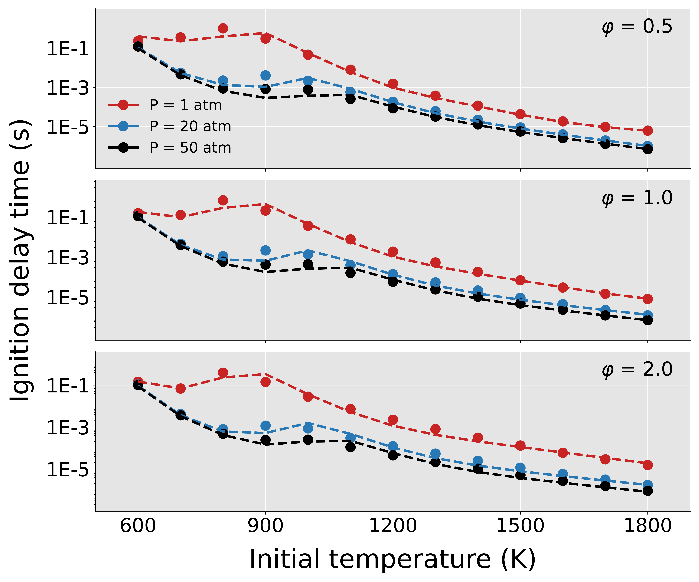
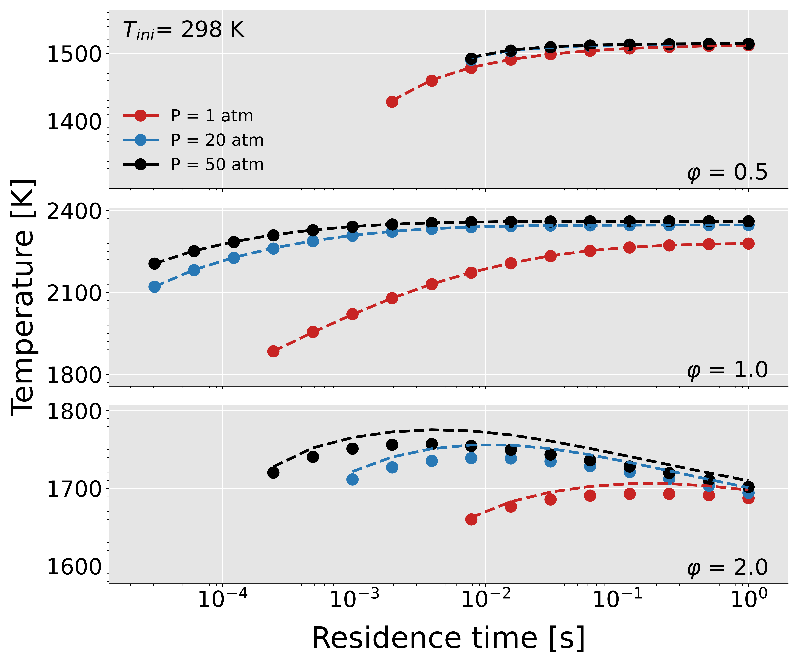
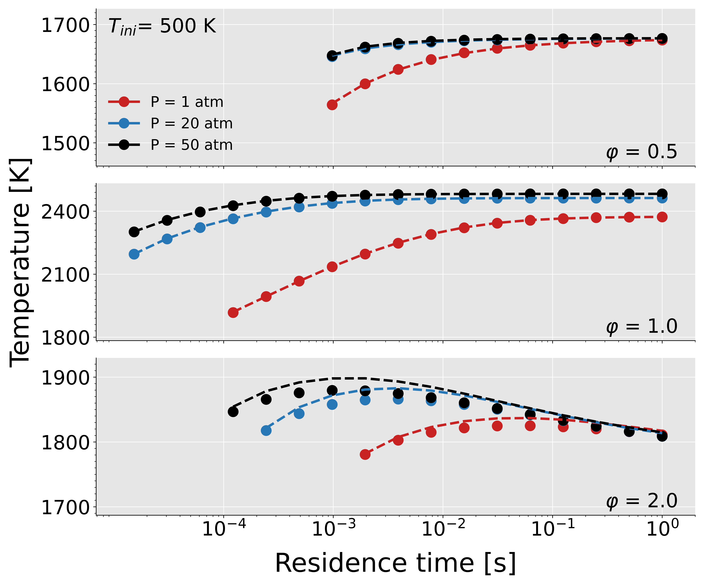
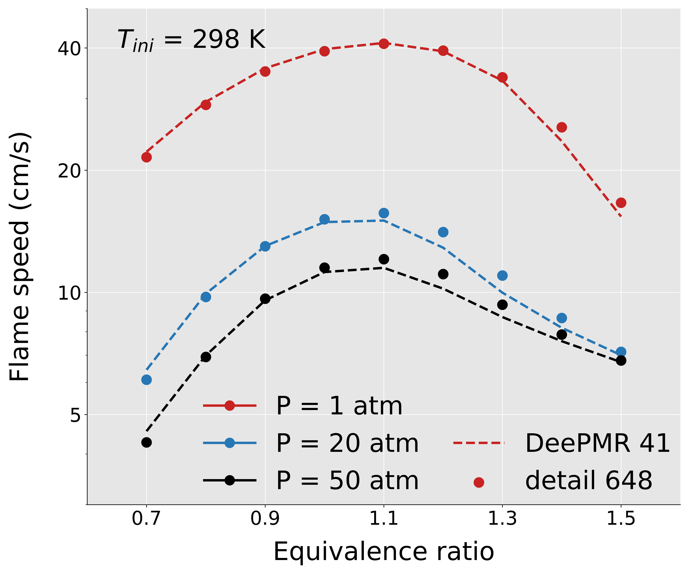
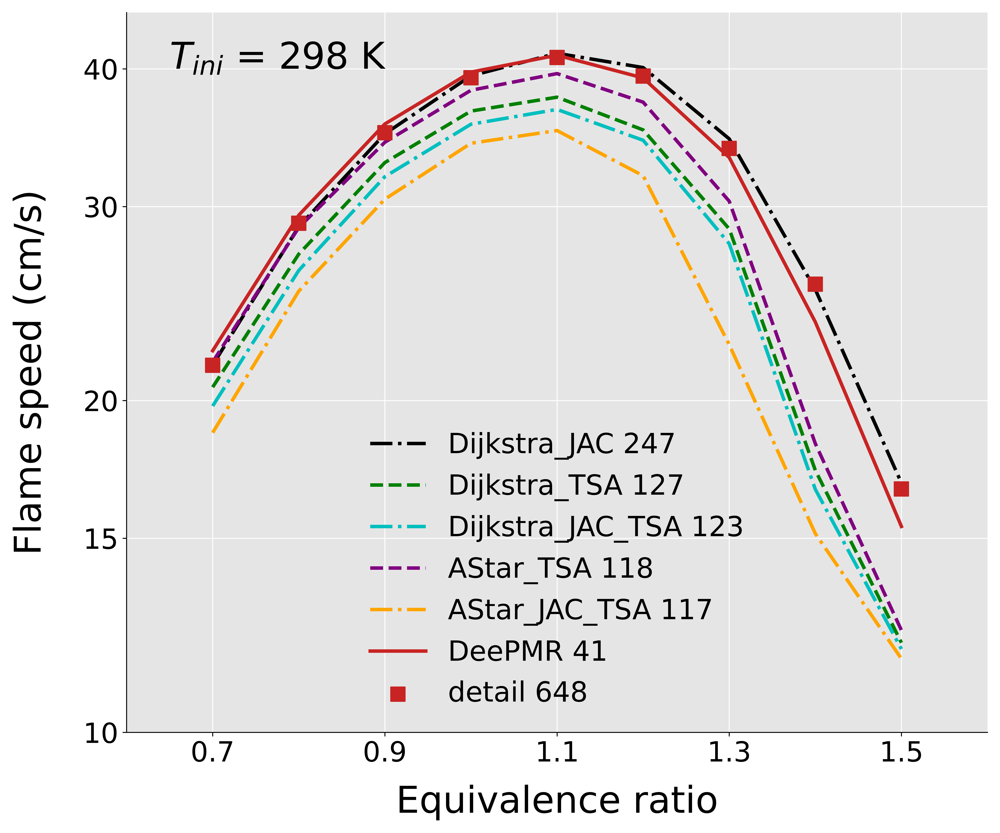
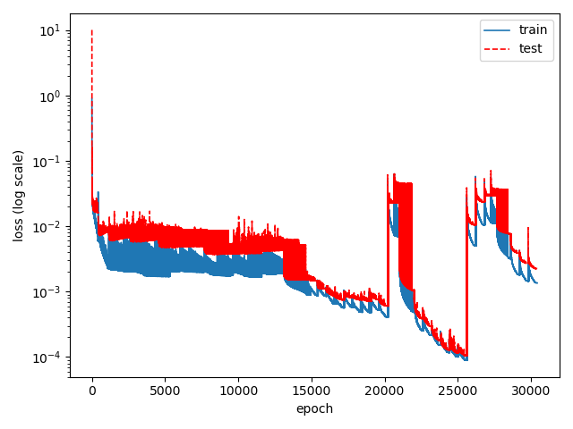

## Reduced model for the n-heptane kinetic model (LLNL, 2011) 

Date: Mar 07, 2023; Maintainer: Zhiwei Wang.

### Detailed kinetic model 

- Mechanism: LLNL_n-heptane_648sp_detailed.yaml
- See [Mehl M, Pitz W J, Westbrook C K, et al. Kinetic modeling of gasoline surrogate components and mixtures under engine conditions[J]. Proceedings of the Combustion Institute, 2011, 33(1): 193-200.](https://www.sciencedirect.com/science/article/pii/S1540748910000787?casa_token=OIW80_QsZB0AAAAA:I0alvoVky-3dZOqIFU-JCajEKagglHgnYbzjuKiXiD3ixFN7VeriIBfb_scKyTQzN2N_26UyQIk)
- Species num: *648*
- Reactions num: *4846*

### Model reduced by DeePMR

- Mechanism: LLNL_n-heptane_41sp_skeletal.yaml
- Species num: *41*
- Reactions num: *292*
- Overall average relative error: *19.1%*

### Working condition

**Zero-dimensional homogeneous ignition under constant pressure**

- initial condition
    - Temperature: *600 ~ 1700 K*
    - Pressure: *1 ~ 50 atm*
    - Equivalence ratio: *0.5 ~ 2*
- notice
    - The accuracy is slightly lower in the low temperature area.
- validation
    
    

**perfectly stirred reactors**
- initial condition
    - Temperature: *298 ~ 500 K*
    - Pressure: *1 ~ 50 atm*
    - Equivalence ratio: *0.5 ~ 2*
- validation
    
    

**One-dimensional premixed laminar flame** 
- initial condition
    - Temperature: *around 298 K*
    - Pressure: *1 ~ 50 atm*
    - Equivalence ratio: *0.5 ~ 2*
- validation
    
    

### DNN loss
This picture shows the DNN loss history during iterative sampling. The SGD optimizer and mean square loss function are used for training such DNN model.
